# noise-free-cnv

_noise-free-cnv_ is a program for analyzing and manipulating
DNA microarray data. It is written in C++, using Gtkmm and FFTW.

_noise-free-cnv_ is free software under the terms of the GNU
General Public License version 3.

### Downloads:

 - [Microsoft Windows installer file](https://github.com/ginsbach/noise-free-cnv/raw/main/distribute/noise-free-cnv-2.1-1-win64.msi)
 - [Microsoft Windows zip archive](https://github.com/ginsbach/noise-free-cnv/raw/main/distribute/noise-free-cnv-2.1-1-win64.zip)
 - [source code (GPL 3)](https://github.com/ginsbach/noise-free-cnv/raw/main/distribute/noise-free-cnv-2.1-src.tar.gz)
 - [view on GitHub](https://github.com/ginsbach/noise-free-cnv)
 
## Motivation

The _noise-free-cnv_ program package has been specifically developed to
analyze DNA microarray data for copy number variation and to manipulate such
datasets in order to reduce noise.

The central program of the _noise-free-cnv_ package is
_noise-free-cnv-gtk_, a visual editor for interactive visualization and
manipulation of DNA microarray data. Besides functioning as a browser for
direct inspection and verification of alleged CNV findings, it allows the user
to perform many operations on the data to separate and eliminate noise
components. 

As a second program, _noiser-free-cnv-filter_ implements a specific
algorithm for system noise reduction of DNA microarray data. It is usable as a
command line program to be easily applied to a batch of datasets.

Both programs are able to read and write files suitable for PennCNV.

## Features

 - interactive visualization of DNA microarray data
 - provides functions to enhance the quality of the data
 - compatible with PennCNV files
 - easy to install and to use, no special hardware or software requirements
 - available for Windows (XP, Vista, 7) and Linux (Debian, Ubuntu, Mint)




## Examples

### Subtracting files from each other

1) start the program | 2) load a file containing LRR and BAF values | 3) visualize the file
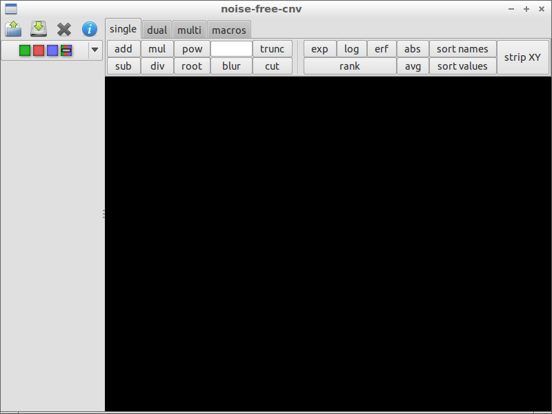 | 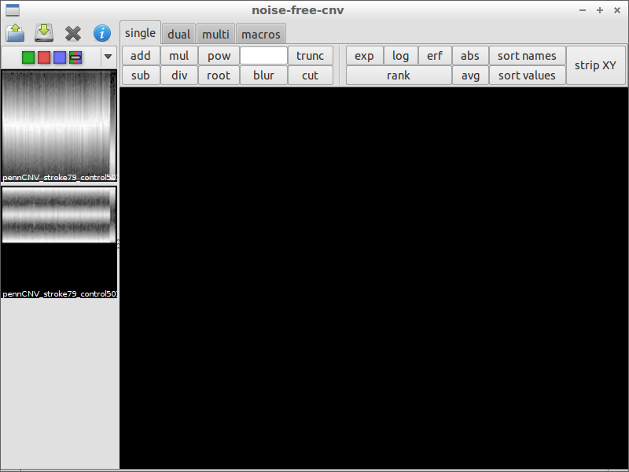 | 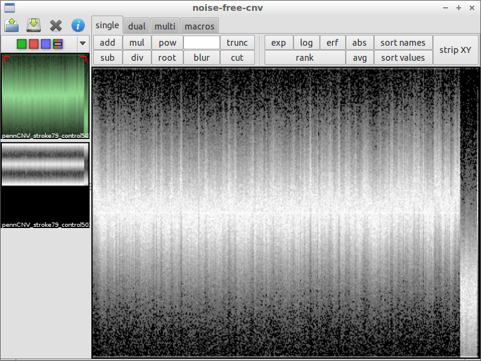
4) inspect interesting spots | 5) load another file for comparison | 6) subtract the files from each other
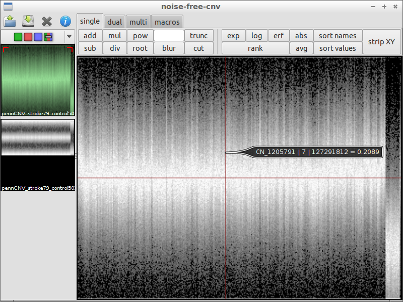 | 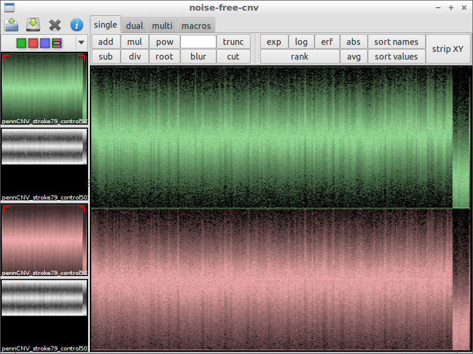 | 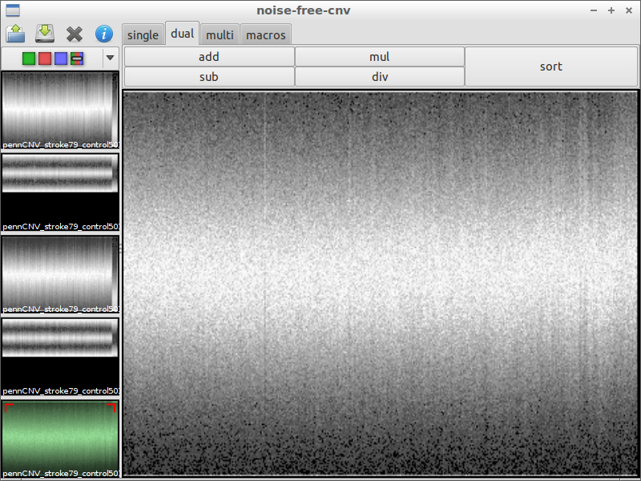
7) use _blur_ to remove noise | 8) look for irregularities | 9) zoom in and compare with the original data
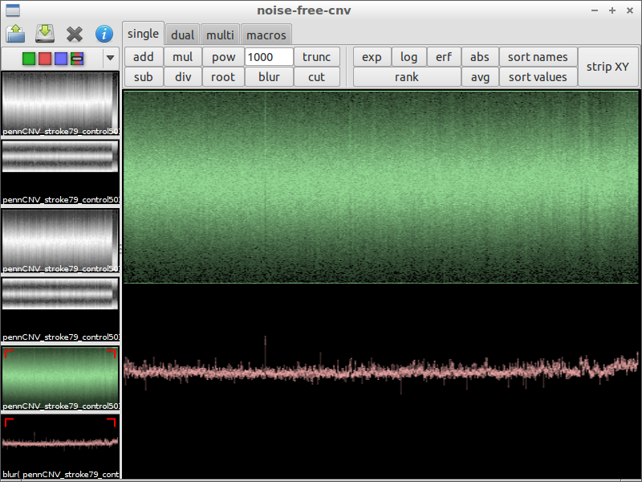 |  | 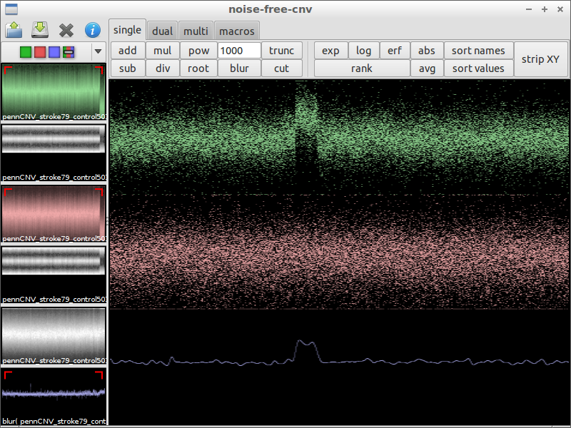

### Filtering high and low frequencies

1) start the program | 2) load a file containing LRR and BAF values | 3) use _blur_ with a huge factor to get the chromosomal waves
 |  | 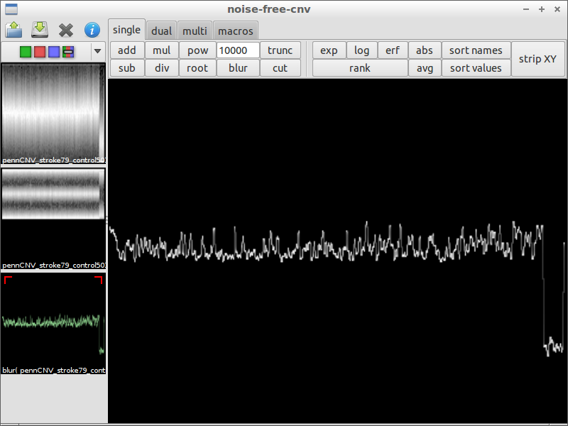
4) compare with original data | 5) subtract the chromosomal waves | 6) use _blur_ with a small factor to remove noise
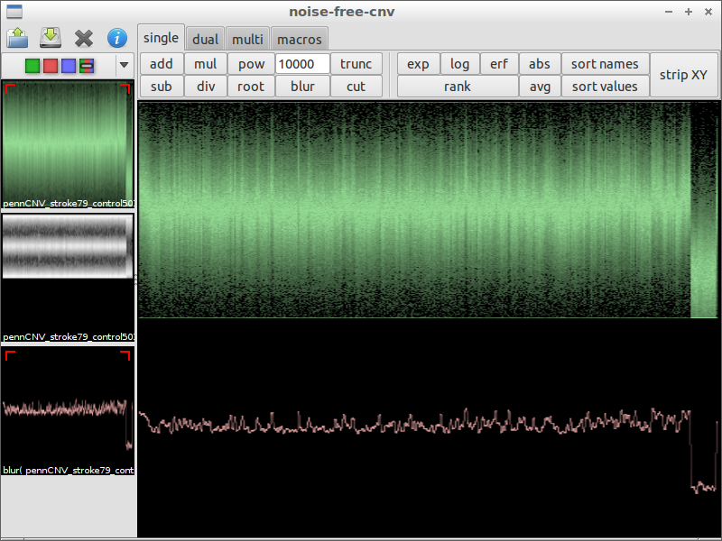 | 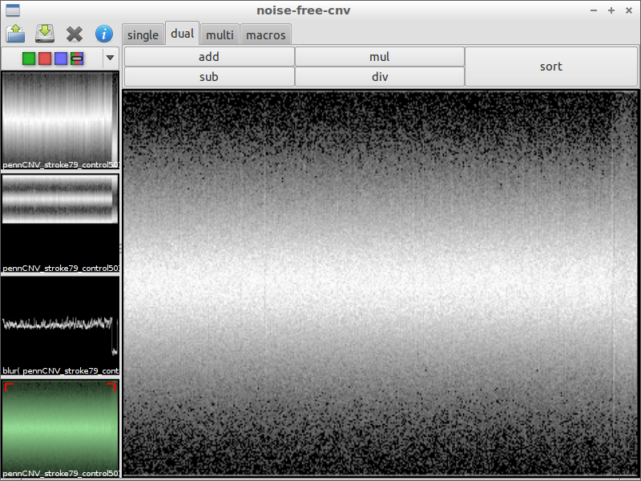 | 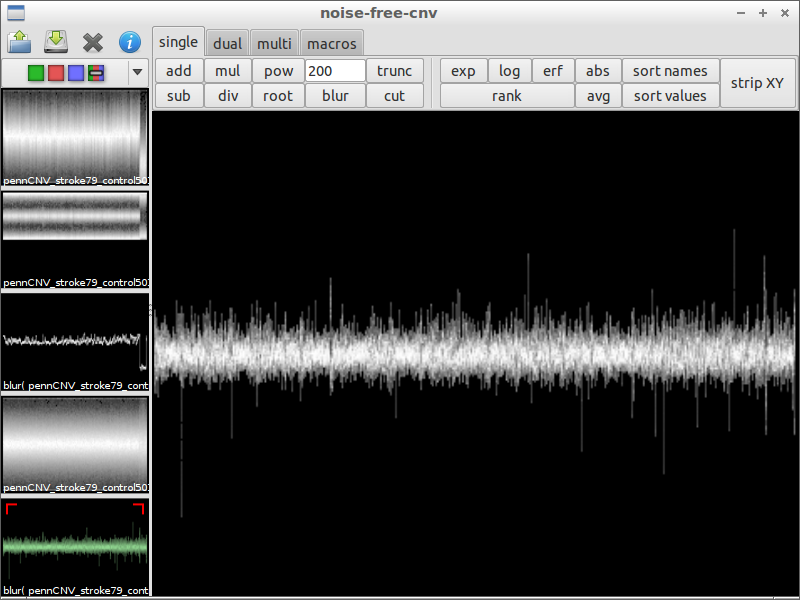
7) search interesting spot | 8) compare with the original data | 9) zoom in
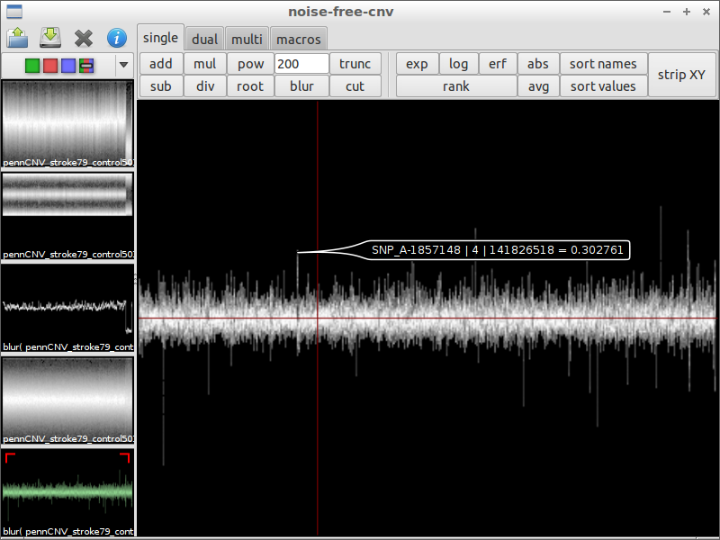 | 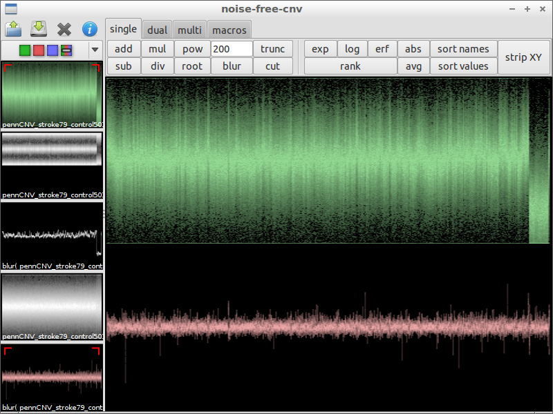 | 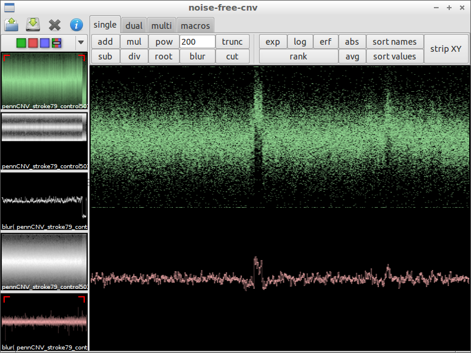

